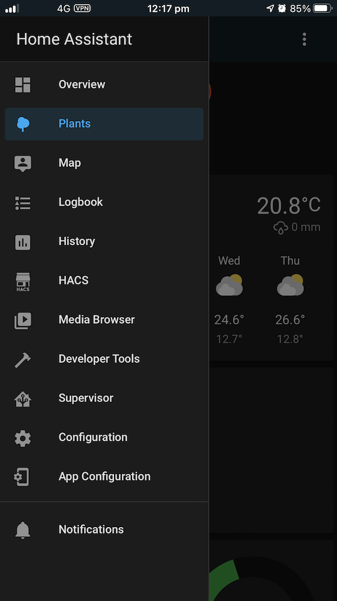
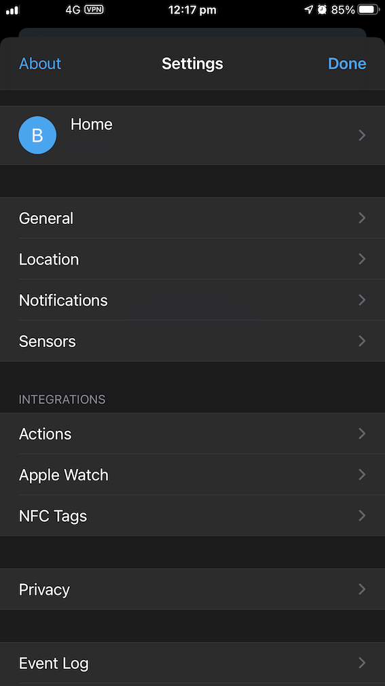
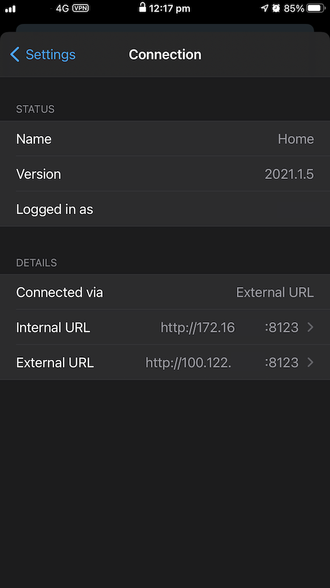
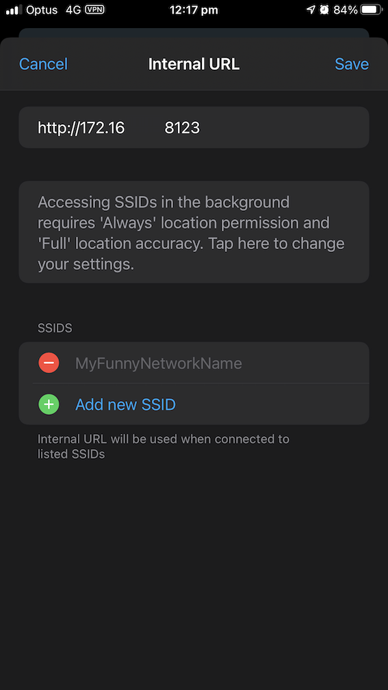

# Home Assistant Add-on: Tailscale

# Quick Installation
1. Open this [My Home Assistant Redirect Link](https://my.home-assistant.io/redirect/supervisor_add_addon_repository/?repository_url=https%3A%2F%2Fgithub.com%2Fhass-tailscale%2Fhass-addons)
2. Enter your Home Assistant instance (if not already) and click “save.”
3. You will get a warning: "Open page in your Home Assistant? You've been linked to the page that will show the add app repository dialog with a specific repository URL pre-filled."`
4. Click “Open Link,” and you’ll be taken to the add-on store with the repository URL pre-filled. Click “Add” to add the repository.
5. Wait for the page to finish reloading, find the “Tailscale” add-on, and click it.
6. Click on the “Install” button.

## Manual Installation

Follow these steps to get the add-on installed on your system:

1. Navigate in your Home Assistant frontend to **Supervisor** -> **Add-on Store**.
2. Click the “dot dot dot” icon in the top right corner, followed by the **Repositories** button.
3. Enter `https://github.com/hass-tailscale/hass-addons.git` as the new repository and click Add.
4. Click the “dot dot dot” icon in the top right corner again, and click the **Reload** button.
5. Wait for the page to finish reloading, find the “Tailscale” add-on, and click it.
6. Click on the “Install” button.

## How to use

To use this add-on, you will need to have an account with Tailscale.

A free tier account can be created at their website: <https://login.tailscale.com/start>

Once you have an account registered, follow the following steps to start using the add-on:

1. Log into the Tailscale admin portal (<https://login.tailscale.com/admin/authkeys>) and navigate to the **Keys** section.
2. You will need to generate an **Authentication Key** that the add-on will use to join your system to your Tailscale account. It is recommended that you generate a **One-off key** (see `auth_key` below for more details).
3. Navigate in your Home Assistant frontend to **Supervisor** -> **Dashboard** and click on the **Tailscale** addon.
4. From the **Tailscale** page in your Home Assistant addons, navigate to **Configuration** and add the following line before saving (substituting `tskey-aaaaaaa...` for the key generated in step 2).

    ```yaml
    auth_key: tskey-aaaaaaaaaaaaaaaaaaaaaaaa
    # optionally, set a custom hostname for the addon to register to Tailscale with
    # hostname: myassistant
    ```

5. Navigate back the the **Info** tab and click **Start** to start using the add-on.

## Known issues

**I'm getting "PONG timeout" errors in the add-on log when trying to connect to my Home Assistant system**
It appears that enabling "static port mapping" for outbound NAT on your firewall, along with UPNP/NAT-PMP, may alleviate this issue.

## Configuration

Example add-on configuration:

```yaml
auth_key: tskey-00f9f577b6352d587e673e563
hostname: homeassistant
force_reauth: false
```

### Option: `auth_key` (required)

The `auth_key` is used by the add-on to connect your system to your Tailscale account and is a **Mandatory** option.

The value of this option is generated in the Tailscale Admin console under the **Keys** section: <https://login.tailscale.com/admin/authkeys>

Two types of keys can be generated:

* **One-off Key**: this key is valid to join one machine, and cannot be reused. This is the **Recommended** key to use when configuring this Add-on.
* **Reusable Key**: This key can be used an unlimited number of times to connect an unlimited number of systems to your Tailscale account. It must be explicitly revoked to prevent its use. It is **strongly discouraged** you use this key when configuring the add-on, as compromise of the key could result in unauthorised devices being added to your Tailscale account.

If, for some reason, you must re-authenticate the add-on to your Tailscale account and you have used a **One-off Key** as recommended, you will need to generate a new key and update `auth_key` when enabling the `force_reauth` option (see below).

### Option: `hostname` (optional)

This option determines the name of your system as it will appear in Tailscale (for instance, to other clients).

This value defaults to `homeassistant`.

### Option: `force_reauth` (optional)

Setting this option to `true` will cause Tailscale to try to reauthenticate to the service when the container is started.

This should only be enabled if, for some reason, the add-on can no longer communicate with Tailscale. You will likely need to generate a new **One-off key** and update the `auth_key` option.

Once authentication to Tailscale's servers has been restored, you **must** set `force_reauth` to `false` again to prevent reauthentication occurring every time the add-on is started or restarted

This value defaults to `false`.

### Option: `reset` (optional)

Setting this option to `true` will cause Tailscale to reset its configuration settings by passing the `--reset` argument to `tailscale`.

There are limited circumstances in which this setting is required, such as when changing published routes. In these circumstances, your log output will likely include lines such as

```text
Error: changing settings via 'tailscale up' requires mentioning all
non-default flags. To proceed, either re-run your command with --reset [...]
```

This value defaults to `false`.

### Option: `port` (optional)

This option (if set) determines the UDP port that `tailscaled` listens on.

It shouldn't be necessary to set this value, as a random port is chosen at startup, and UPNP/NAT-PMP should ensure it is appropriately accessible.

### Option: `advertise_routes`

Tailscale allows you to advertise routes to subnets, accessible on the network your Home Assistant is connected to, to other clients.

This can be configured by adding the IP addresses or subnets (comma-separated) of routes you want to advertise to the `advertise_routes` option. For example:  advertise_routes: `192.168.1.0/24,192.168.2.1/32` to advertise the entire `192.168.1.0/24` subnet and additionally the host `192.168.2.1`.

You will then need to visit Tailscale to complete the setup:

  1. Log into the admin portal: <https://login.tailscale.com/admin/>
  2. Find your Home-Assistant in the Machines tab and click on it.
  3. Click the "review" button under "Subnets" and enable your advertised route.

By default, this option is not set, and only your Home Assistant will be accessible via Tailscale.

Note: Tailscale may say "This machine has IP forwarding disabled and cannot relay traffic" - currently, this appears to be inaccurate, and you are still able to use subnets published by Home Assistant.

See <https://tailscale.com/kb/1019/subnets> for more information.

### Option: `advertise_exit_node`

This option (if set) advertises that other clients can use the Tailscale instance running on your Home Assistant to connect to the internet (similar to a regular VPN service).

If enabled, you will then need to visit Tailscale to complete the setup:

  1. Log into the admin portal: <https://login.tailscale.com/admin/>
  2. Find your Home-Assistant in the Machines tab and click on it.
  3. Click the "Review Route Settings" button under the "..." button on the top right, and enable "Use as exit node".

Note: Tailscale may say "This machine has IP forwarding disabled and cannot relay traffic" - currently, this appears to be inaccurate, and you are still able to use your Home Assistant as an exit node.

See <https://tailscale.com/kb/1103/exit-nodes> for more information.

### Option: `exit_node`

This option (if set) configures Tailscale to route all non-Tailscale internet traffic through the specified Tailscale peer IP.

If enabled, you will need to have preconfigured the specified IP as an exit node. See the [Official Guide](https://tailscale.com/kb/1103/exit-nodes/#:~:text=in%20the%20future.-,Step%201%3A%20Advertise%20a%20device%20as%20an%20exit%20node,-From%20the%20device) for more information.

### Option: `login_server`

This option (if set) configures to use an alternative login server. This allows this addon to be used with [headscale](https://github.com/juanfont/headscale), an open source, self-hosted implementation of the Tailscale control server.

### Option: `accept_routes`

This option (if set) configures Tailscale to enable connectivity to 100.64.0.0/10 style Tailscale IP addresses.

See [Subnets](https://tailscale.com/kb/1019/subnets/#step-5-use-your-subnet-routes-from-other-machines) for more information.

### Option: `userspace_networking`

This option (if set) configures tailscale to use its userspace networking mode. This should be unnecessary, but it can be tested if connectivity issues occur.

See [Userspace networking (container) mode](https://tailscale.com/kb/1112/userspace-networking/) for more information.

### Option: `tags`

This option (if set) configures tailscale to advertise the given tags. The format is the same as for `tailscale up --advertise-tags`: all tags prefixed with `tag:` and separated with commas (ex: `tag:server,tag:hass`).

See [Server role accounts with ACL tags](https://tailscale.com/kb/1068/acl-tags/) for more information.

### Option: `cert_domain`

This option (if set) configures tailscale to provision TLS certificates. The format is the same as for `tailscale cert <your-domain>`. It's necessary to set the exact domain under which your home assistant instance is running.

1. Go to [DNS tab](https://login.tailscale.com/admin/dns) in Tailscale's admin page
2. Choose a **Tailnet name** and click **Enable HTTPS** under HTTPS Certificates
3. Find your Home-Assistant in the [Machines tab](https://login.tailscale.com/admin/machines) and note under which name your device is reachable
4. Your device should now be reachable under `https://<machine-name>.<tailnet-name>.ts.net` (but with an invalid SSL certificate)
5. Go to the **Configuration tab** of this add-on and set the above domain (`<machine-name>.<tailnet-name>.ts.net`) at `cert_domain`
6. Restart the add-on; you should now have two new files under `/ssl`, which you can use to configure any web server.
7. Visit the above domain again, you should now have a valid SSL certificate (if you encounter strange browser behaviour or strange error messages, try to clear all site-related cookies, clear all browser cache, restart browser)

See [Enabling HTTPS](https://tailscale.com/kb/1153/enabling-https/) for more information.

### Option: `ssh`

This option (if set) advertises that Tailscale is managing SSH connections that originate from the Tailscale network to this host. This allows you to connect to the addon using SSH. Thanks to [Tailscale SSH Console](https://tailscale.com/blog/ssh-console/), you can even connect to the instance directly in the browser.

You can get shell access to this addon, then from there, you can connect to the other hosts in your network.

See <https://tailscale.com/kb/1193/tailscale-ssh/> for more information.

### Option: `disable_dns`

This option disables `tailscale` from accepting DNS resolvers. It is currently for experimental testing.

### Option: `advertise_connector`

This option (if set) configures tailscale to advertise as an _App Connector_.
See [Secure your SaaS with Tailscale App connectors](https://tailscale.com/blog/saas) for more information on how to utilise this feature.

## How to connect your Home Assistant App (iOS)

To ensure you can access Home Assistant from your mobile app when you're using Tailscale away from home, or when you're at home and have the app turned off:

* Open up the sidebar by clicking the hamburger button on the top-right of the Home Assistant App, and click "App Configuration."



* Click the name of your Home Assistant instance at the top of the menu (e.g., "Home")



* Update the External IP to the IP assigned to your Home Assistant by Tailscale (likely `100.X.Y.Z`). You will likely also need to specify the port (by default, this is `8123`).



* Update your Internal IP if required, and assign your home WI-FI network name (SSID) so that the App knows which network your Home-Assistant is connected to internally.



## Support

Got questions? Open an issue at <https://github.com/hass-tailscale/hass-addons/issues>
